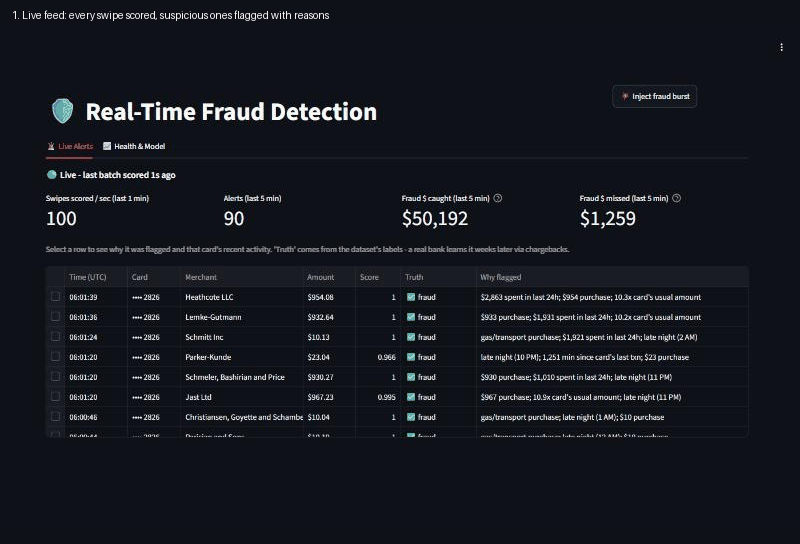
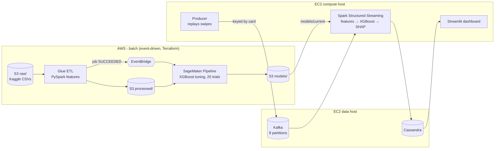
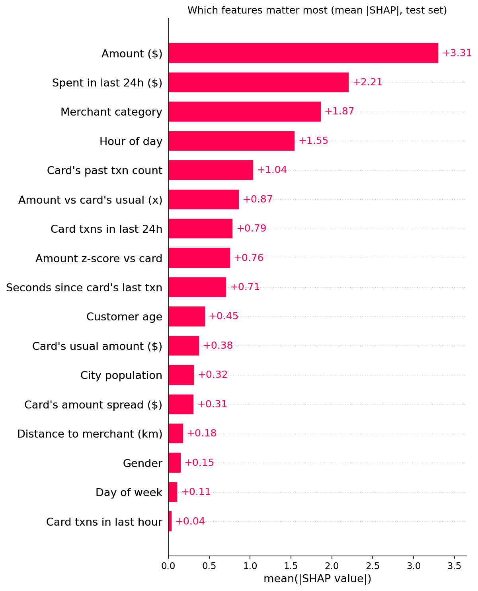
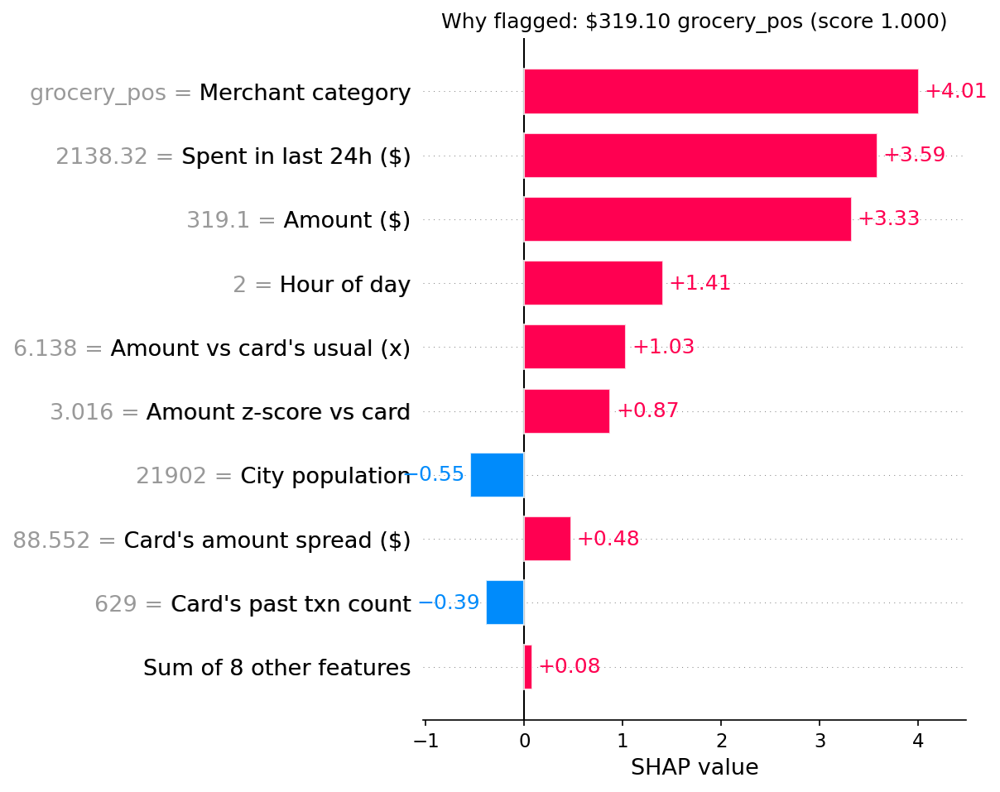
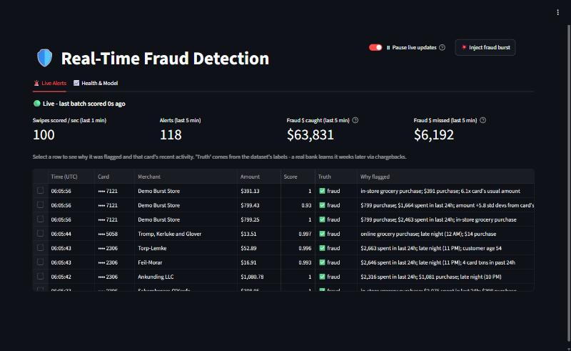
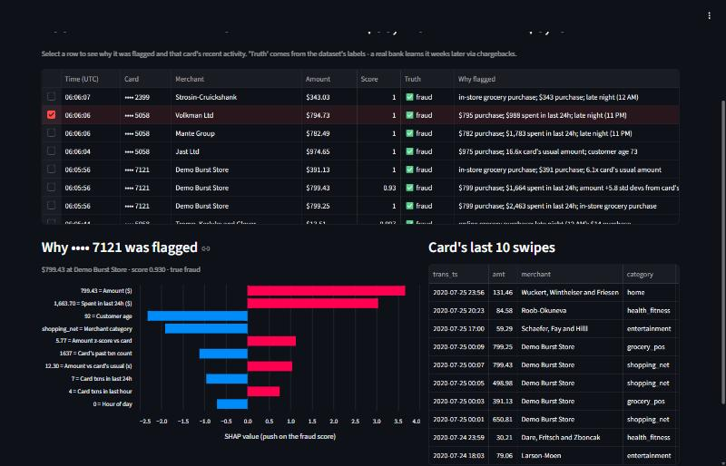
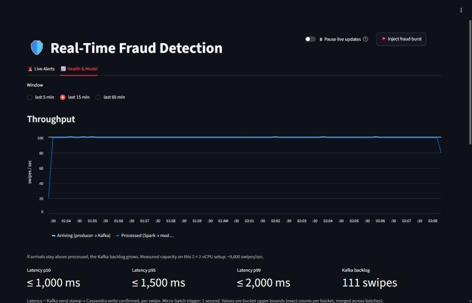

# Streaming Fraud Detection

Real-time credit card fraud detection on AWS. Card swipes stream through **Kafka** into **Spark Structured Streaming**, which computes per-card behavioural features, scores each swipe with an **XGBoost** model trained on **SageMaker**, explains every flag with **SHAP**, and writes to **Cassandra**. A **Streamlit** dashboard shows alerts, the reason for each one, and pipeline health live. Glue ETL and model retraining are event-driven, and all infrastructure is **Terraform**.



| | |
|---|---|
| **Detection quality** (555,719 held-out transactions, 0.4% fraud) | PR-AUC **0.976**, ROC-AUC **0.9995**: catches **91%** of fraud at **96%** precision, **96%** of fraud dollars |
| **Latency** (Kafka send → alert written to Cassandra) | p95 **≈ 1.4 s** at 100 swipes/s, **≈ 1.6 s** at 5,000 swipes/s |
| **Throughput** | ≈ **9,600 swipes/s** capacity on 2 × 2-vCPU hosts (10,000/s at p95 1.8 s with the lighter v2 model) |
| **Train/serve parity** | Stream features match the training pipeline exactly on all 555,719 swipes × 17 features |

---

## Architecture



**Batch side.**
1. **AWS Glue** (PySpark) turns 1.85M raw transactions into model features. That includes point-in-time card history computed with window functions.
2. When the Glue job succeeds, an **EventBridge** rule starts a **SageMaker Pipeline**.
3. The pipeline runs **Bayesian hyperparameter tuning** over 20 XGBoost trials, ranked on validation PR-AUC.
4. The model is promoted by copying it to `models/current/`.

**Streaming side.**
1. A producer replays the held-out period (Jun–Dec 2020) into Kafka as live swipes, keyed by card number.
2. Spark reads Kafka in 1-second micro-batches.
3. Card-history features are computed from per-card state.
4. Each swipe is scored with the model. Flagged swipes are explained with exact TreeSHAP plus plain-English reasons, e.g. *"$3,071 spent in last 24h; $789 purchase; late night (11 PM)"*.
5. Everything is written to Cassandra, and the dashboard reads it.

**Hosts.** Two `m7i-flex.large` instances (2 vCPU / 8 GB each) split by tier:
- **data host:** Kafka (KRaft) + Cassandra
- **compute host:** Spark, producer, dashboard

They accept no inbound traffic from the internet. Access is through SSM Session Manager.

## Model

| | v1 baseline | v2 point-in-time features | **v3 tuned (served)** |
|---|---|---|---|
| PR-AUC | 0.800 | 0.974 | **0.976** |
| ROC-AUC | 0.995 | 0.999 | **0.9995** |
| Recall / precision | 69% / 86% | 92% / 95% | **91% / 96%** |
| Fraud $ caught | 78% | 96% | **96%** |
| False alarms / missed (of 553,574 legit / 2,145 fraud) | 242 / 669 | 100 / 161 | **73 / 193** |

- **Why not accuracy?** With 0.4% fraud, a model that always answers "legit" scores 99.6% accuracy. The metrics above are all about the fraud class.
- **v1 → v2 was the big jump.** SHAP exposed two problems in v1:
  - Cards never seen in training were scored as *extra safe*.
  - Card averages were computed over the whole year, so they peeked at the future.

  v2 rebuilt every card feature from that card's **earlier** transactions only, and added velocity features (swipes in the last 1h/24h, spend in the last 24h, seconds since last swipe). Fraud here comes in bursts, so `amt_sum_24h` became a top-3 signal.
- **v2 → v3:** 20 tuning trials all landed within 0.985–0.988 validation PR-AUC. The model is robust to its settings, and the features did the heavy lifting.
- **The test set is never used to choose anything.** Validation is the most recent 20% of the training period (time-based split). The decision cutoff is picked on validation and only reported on test.

<p>
  
  
</p>

Full reports for each version, including metrics, threshold trade-offs and SHAP charts, are in [`reports/`](reports/).

## Streaming performance

All numbers are from the pipeline's own `pipeline_metrics` table. Latency is measured per swipe, from Kafka's send timestamp to the Cassandra write being confirmed. The producer and Spark share a clock on the compute host.

| Load | Batch processing | Latency p50 / p95 / p99 |
|---|---|---|
| 100 swipes/s | ~0.4 s | ~0.9 s / **~1.4 s** / ~1.4 s (121 consecutive batches, worst p95 1.77 s) |
| 1,000 swipes/s | ~0.27 s | ~0.8 s / **~1.2 s** / ~1.3 s |
| 5,000 swipes/s | ~0.6 s | ~1.2 s / **~1.6 s** / ~1.7 s |
| 10,000 swipes/s, v3 model | ~5.2 s per 50k swipes | falls behind: capacity ≈ 9,600/s |
| 10,000 swipes/s, v2 model | ~0.8 s per 10k swipes | ~1.3 s / **~1.8 s** / ~1.8 s |

Where the time goes at 10k swipes/s with v3, per 50,000 swipes:

| Kafka read | Features | Predict | SHAP | Cassandra write |
|---|---|---|---|---|
| 1.0 s | 0.3 s | 1.2 s | 1.3 s | 1.4 s |

These are short step tests (75–90 s per rate) on 2 × `m7i-flex.large`, the largest instances the AWS account's Free plan allows.

## Engineering notes

- **Profiled, then redesigned the stream.**
  - The first version kept card state in Spark with `applyInPandasWithState`. Profiling showed **~0.1 s of Python work inside 2–4 s batches**: on 2 vCPUs, moving data between the JVM and Python workers dominated.
  - Feature computation moved into one vectorized `foreachBatch` step. Per-card state is snapshotted after every batch and tagged with Spark's batch id, so a batch replayed after a crash restarts from the previous snapshot and nothing is double-counted.
  - p95 latency went from **5–19 s to ~1.4 s**.
- **Train/serve parity test.** [`tests/test_feature_parity.py`](tests/test_feature_parity.py) runs every held-out swipe through the *streaming* feature code and compares it with Glue's features: **17/17 features identical on 555,719 swipes**. It caught a pandas 2 vs 3 timestamp-unit bug that would have silently fed the model wrong "seconds since last swipe" values.
- **Load-test hygiene found a real bug.** Replaying the same period twice made event time go backwards. Each card's 24-hour list then never expired, and per-batch time climbed from 0.2 s to 17 s. The fix trims against the *latest* time seen, which also makes the stream tolerant of late events. In-order results are unchanged, and the parity test still passes.
- **Query-first Cassandra schema.** One table per question, and every dashboard read hits a bounded set of partitions:
  - `transactions_by_card`: partitioned by card, newest first
  - `alerts_by_minute`: partitioned by minute
  - `pipeline_metrics`: partitioned by day, one row per batch

  Latency and scores are stored as fixed-bucket histograms, so the dashboard can merge batches into exact percentiles and rebuild the confusion matrix for any cutoff.
- **Event-driven retraining, no scheduler.** Glue success → EventBridge → SageMaker Pipeline, all in Terraform. Training code is uploaded by Terraform and mounted into the AWS XGBoost container as a plain S3 folder.
- **Messages carry no names or addresses.** The true label rides along *only* so the dashboard can grade the model live. A real bank gets labels weeks later, via chargebacks.

## Dashboard

| Live alerts | Why it was flagged | Health & model |
|---|---|---|
|  |  |  |

**Live Alerts tab:**
- Live / idle / stalled badge
- Swipes per second, alerts, fraud dollars caught and missed
- Alert feed with plain-English reasons and a true-label badge
- Click an alert for its SHAP chart and the card's last 10 swipes
- **💥 Inject fraud burst** sends a stolen-card-style spree for a real card

**Health & Model tab:**
- Arriving vs processed throughput
- p50 / p95 / p99 latency and Kafka backlog
- Per-minute precision / recall
- A what-if cutoff slider and the score distribution

## Repository layout

```
infra/        Terraform: S3, IAM, network, 2 EC2 hosts, Glue job, SageMaker pipeline, EventBridge rule
glue/         Glue ETL job (PySpark): raw CSV -> features (Parquet)
training/     SageMaker training script: XGBoost, metrics, SHAP reports
stream/       Spark streaming job, feature logic (shared with the parity test), scoring + SHAP
producer/     Replays held-out transactions into Kafka
dashboard/    Streamlit app
cassandra/    Schema
tests/        Train/serve feature parity test
src/          Loads the Kaggle dataset into S3
reports/      Model reports per version (metrics, SHAP charts)
```

## Running it

Prerequisites:
- An AWS account
- [Terraform](https://developer.hashicorp.com/terraform), the AWS CLI and the [Session Manager plugin](https://docs.aws.amazon.com/systems-manager/latest/userguide/session-manager-working-with-install-plugin.html)
- Python 3.11
- A Kaggle API token

**1. Credentials and tools.** Copy `.env.example` to `.env`, fill it in, and install the tools:
```bash
python -m venv .venv
```
```bash
.venv/Scripts/pip install -r requirements.txt
```

**2. Infrastructure.** Run from `infra/`. Set `DATA_BUCKET` in `.env` to the `bucket_name` output.
```bash
dotenv -f ../.env run -- terraform apply
```

**3. Data, features and model.** Run the upload and Glue commands, then promote the model:
```bash
python src/upload_raw_data.py
```
```bash
dotenv run -- aws glue start-job-run --job-name streaming-fraud-detection-etl-features
```
- When Glue finishes, EventBridge starts the tuning pipeline (about 40 minutes).
- Then promote the best trial's `model.tar.gz` to `s3://<bucket>/models/current/model.tar.gz`.
- The stream loads it on its next start.

**4. Stream.**
- The hosts start Kafka/Cassandra and the stream/dashboard themselves on first boot.
- Open a shell on the compute host with `aws ssm start-session --target <compute instance id>`, then replay traffic:
```bash
cd /opt/fraud && docker compose run --rm producer --rate 100
```

**5. Dashboard.** Either port-forward 8501 over SSM, or open it to your IP only. Then browse the `dashboard_url` output.
```bash
dotenv -f ../.env run -- terraform apply -var dashboard_cidr=<your-ip>/32
```

**Cost.**
- The two hosts cost ~$0.19/hr; stop them when idle.
- A Glue run is ~$0.02, a training run ~$0.01, and a 20-trial tuning run ~$0.20.
- `terraform destroy` removes everything.

## Limitations

- **Synthetic data.** The [Kaggle credit card transactions dataset](https://www.kaggle.com/datasets/kartik2112/fraud-detection) was generated with Sparkov. Real fraud is messier, and real labels arrive weeks late.
- **Single-node Kafka and Cassandra** (replication factor 1). That's fine for a demo, not for production.
- **Card state lives in the Spark driver,** snapshotted per batch. That scales vertically. Scaling out would mean partitioned state, e.g. `flatMapGroupsWithState` in Scala, where per-task overhead is lower.
- **The dashboard has no authentication.** It is only reachable over SSM or from a single allow-listed IP.
